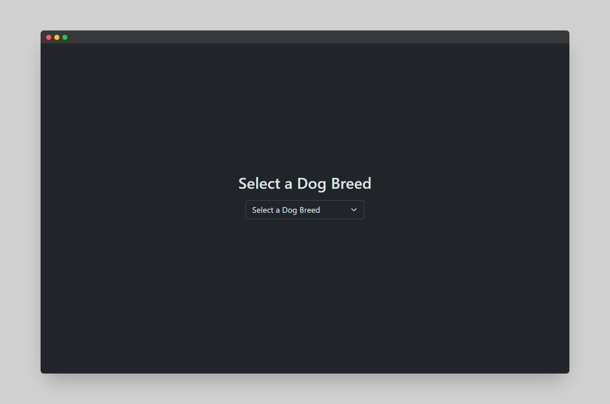
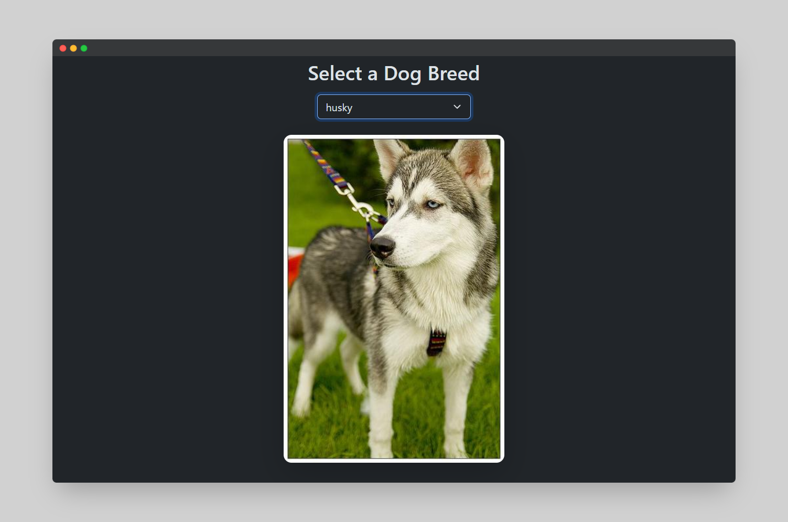

# Fetch GET Query API Demo

This project demonstrates the use of the Fetch API to retrieve data using GET requests from a public API. The simple web application allows users to search for placeholder data and displays the results dynamically on the webpage.

## Live Demo

You can view the live demo of this project here: [Fetch GET Query API Demo](https://aarshpatel1.github.io/fetch-get-query-api/)

After loading the website, the first look



After selecting any dog breed (example: I selected Husky here), the website look



## Features

- Simple user interface with an input field to search data.
- Uses the Fetch API to send GET requests to an API endpoint.
- Dynamically displays the search results on the webpage.
- Clean and minimal design for better user experience.

## Technologies Used

- **HTML5**: For structuring the web page.
- **CSS3**: For styling the UI components.
- **JavaScript (ES6+)**: For handling the logic of fetching data and updating the DOM.
- **Fetch API**: To send GET requests and retrieve data from an external API.

## Usage

To use this web app:

1. Enter a query in the search field.
2. The app will send a GET request to the API endpoint and display the results dynamically.
3. The results are fetched and displayed in a clean, user-friendly format.

## API Reference

The app interacts with a public API to fetch placeholder data. You can refer to the API documentation for details on the available endpoints and usage examples.

## How to Run Locally

To run this project locally:

1. Clone the repository:  
   ```bash
   git clone https://github.com/aarshpatel1/fetch-get-query-api.git
   ```

2. Navigate to the project directory:  
   ```bash
   cd fetch-get-query-api
   ```

3. Open the `index.html` file in your web browser:
   ```bash
   open index.html
   ```


## Acknowledgements

Special thanks to the public API providers for making this demonstration possible.

---

This README provides a clear overview of the project, how to use it, and how to run it locally!
